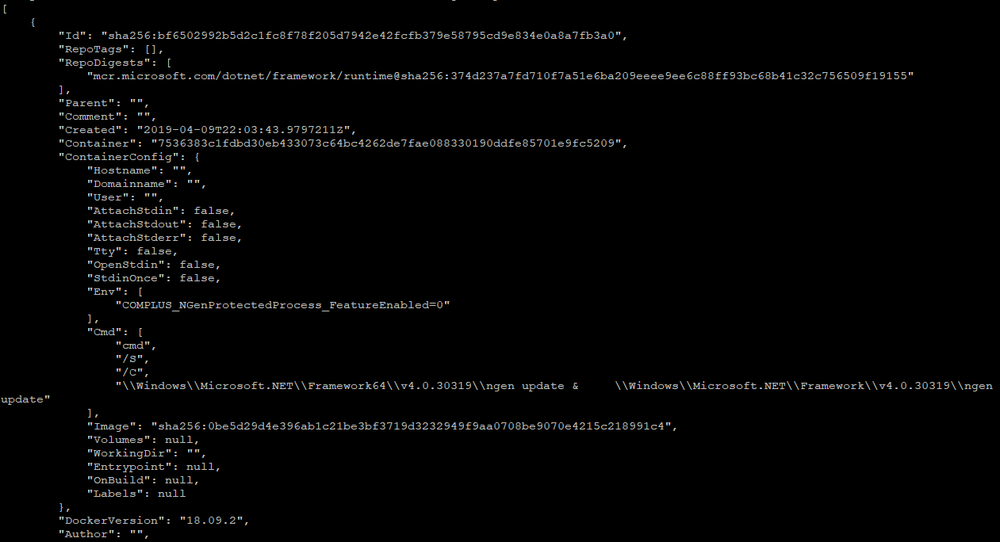
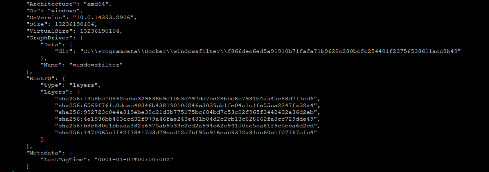

After the image is downloaded, Jones want to understand how the image constructed. The command to inspect the image is

### Explanation


```
   docker image inspect mcr.microsoft.com/dotnet/framework/runtime:4.7.2-windowsservercore-ltsc2016
```

This command will display metadata of image, like id, archtecture, size 



and *layers*



<!--end-->